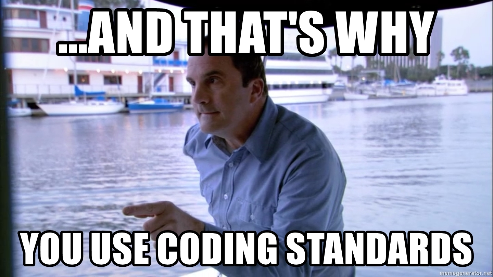

## Making the impossible possible

In the last couple of years I have worked with various teams on different software development projects. One of the most time-demanding tasks for these projects has been to scan through and understand the code another developer has written. However, this has often become a nearly impossible task where the developer's coding standards is not consistent with the team and sometimes not even with himself. An example is when I tried reading a code where the programmer was not consistent with the use of separate naming conventions for local functions and global functions. Then it became an unnecessary difficult task to understand which functions was to be reused in other modules and the functions that was intented to be helper-functions inside the module. This has made me understand the importance of having a set of coding standards for the language you are using in order to prevent a complex codebase structure and potentially angry colleagues.

### ESLint phenomenon
As mentioned, I have become an intermediate software developer after contributing to several projects over the last couple of years. However, (surprisingly enough) I have never written or read much JavaScript code. Therefore, I have been blessed by the linter ESLint that has made me aware of my run-time errors as well as the possible flaws of my code quality and readability. I have changed my "==" to "===" and my "let"-variables to "const". ESLint also discovered my redundant "else"-statement after a return in an if-statement which I was rather impressed by. The rules ESLint provides for code practices, variables and styling has made it easier for me to understand the beauty and possibilities of using JavaScript. The green checkmark is also amazingly satisfying for me being an "organizer" and "perfectionist". I also believe that a code integration will go smoother in a team where everyone has installed ESLint. 

### Learning by reading?
This spring I worked on a bigger software project in Golang where we developed an elevator-system. We wrote code in five different modules (which were to run simultaneously as threads), each having a numerous amount of functions and using global variables. Before getting into the project, I used at least a day or two to search through common coding conventions for the language and set up a Zoom-meeting with my colleagues where we discussed how to use coding standards to ensure readability and smooth code integration. This research made me learn a whole lot more about the language I was writing in and also gave us the opportunity to decide on which conventions we wanted to follow. However, in JavaScript the ESLint can basically do this job for you. I am sure that you learn a lot by reading the error-messages that pops up by the linter, however, I am not sure if that is the way I grasp the language the easiest. I have always been a protagonist for "learning by reading", even though I know the "hype" these days is to "learn by doing". In a programmers world there is of course not possible to learn a language without writing the code, however, I believe that some research and actually reading about the language can help you getting into the code-base easier. 

To sum up, ESLint is undoubtedly a nice feature to provide to your JavaScript code. I am still not sure if this is just taking the easy way out and avoiding actually reading about the coding conventions yourselves. However, the most important part of this essay is to address that coding standards are extremely important to ensure readability and consistency of your code, and to make the impossible task of understanding another code-base possible. 

