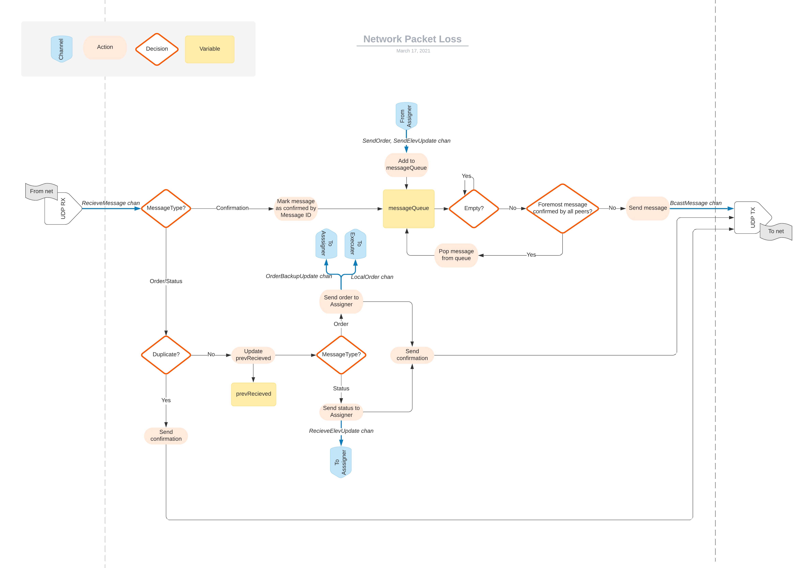

In this project we implemented a real-time system for controlling n elevators in Golang, where we divided our system into the three main modules: Assigner, Distributer and Executer. The flowchart describes how the system handles network packet loss where all peers have to acknowledge that a message has been receieved. Further description and solution to the problem can be found [here](https://github.com/ninanye/TTK4145-Heis).

Reflecting on the project, I have learned and developed a numerous of skills within software development. I have always been a promoter for good structure and thorough planning. I was therefore thrilled to gain valuable insights in the process of developing software where a Design Review forced us to carry out the project in a certain manner. 

