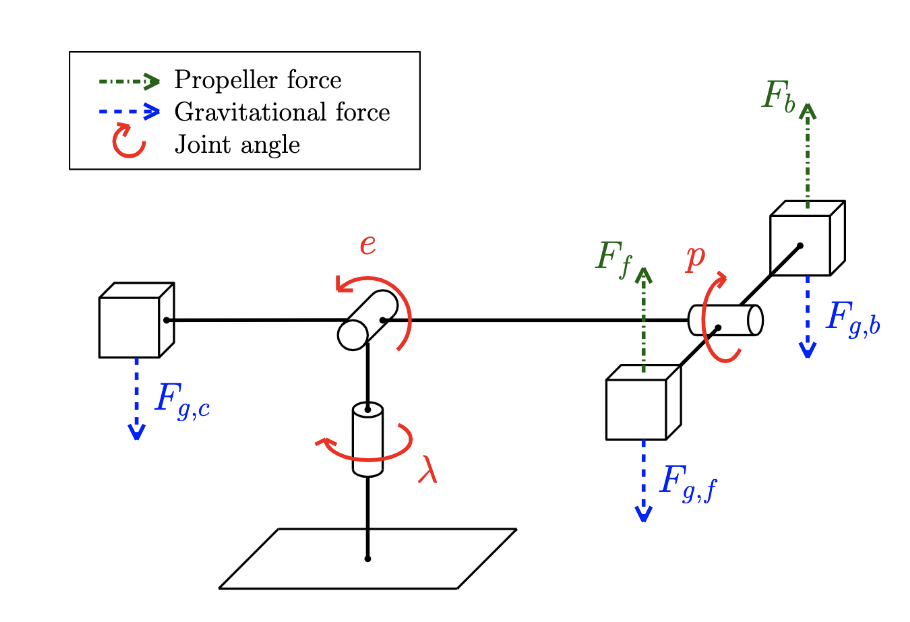

We were assigned different control theory problems ranging from mathematical, theoretical modelling of the system but also controlling the helicopter using Simulink and MATLAB scripts. The report is published <a href="https://github.com/ninanye/helicopter_lab"><i class="large github icon"></i>here</a>.
