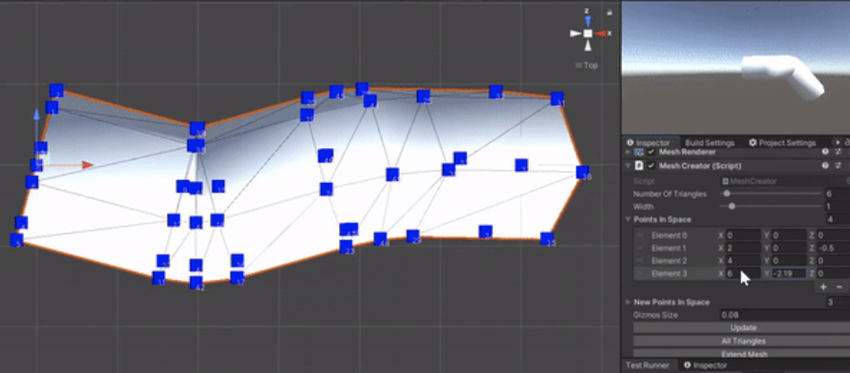

This summer we developed an 3D annotation application for Microsoft HoloLens 2. We used development-platform Unity 3D with C# as our programming language. Built polygons in Unity 3D with the use of trigonometry and quaternions for rotational movement. Currently, the project allows the user to draw in 3D with a 3D line, erase specific lines and clearing the whole space. One can also change the colour and width of the line.

The picture is a screenshot of the mesh we created out of points that gets tracked from the user's hand and a self-made functioning polygon-builder module. Libraries from MRTK, Microsoft Mixed Reality Toolkit, were used to configure the hand joint tracking from the HoloLens 2 headset to the development-platform.  

Unfortunately, the Github-repository for this tool can not be published as this project is work-related with confidential repositories. 

