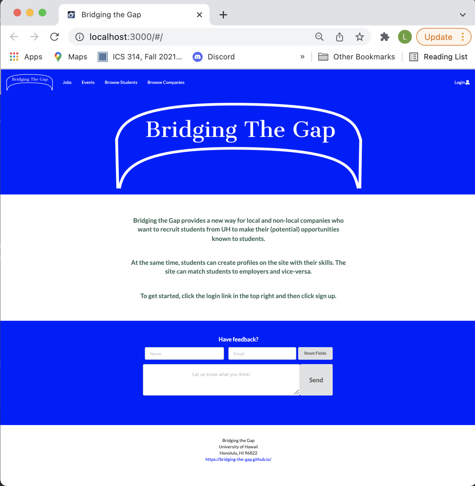

For the ICS314 class we had a developed a software application of our own choice. My team and I decided to create an application for "bridging the gap" and connecting companies from Hawaii and the mainland to UH students. Companies can create profiles and their own home-page where a brief description of the company, their location, job listings and events are listed. Here the companies can edit and add job listings and upcoming events. Students can create a profile in order to be able to browse companies (by location), as well as scrolling through all events and job listings available for UH students. Both companies and students do also have the opportunity to browse students by skills. We have also implemented an admin-site that can monitor the site for inappropriate content, and create new categories of musical tastes, capabilities, and goals.

The web application were implemented in Javascript, the React-library, Mongo DB, Meteor, Intellij IDE and Github for cooperation with the team. The team mostly cooperated on the layout and implementation of the different pages and elements, however, my main task was to implement the "Events"-page as well as adding the opportunity to add and edit events. I was also responsible for deploying the system to Digital Ocean.

From this experience I have learned how to develop and deploy a web application from scratch. I have become more competent in Javascript as well as design tools like HTML and CSS. I have also gained further insight in how to work in a software development team using tools like Github, project milestones and scheduling meetings in order to function optimally as a team. 

More information about the project (including a development guide) can be found [here](https://bridging-the-gap.github.io/).
The source code is published <a href="https://github.com/bridging-the-gap"><i class="large github icon"></i>here</a>.
